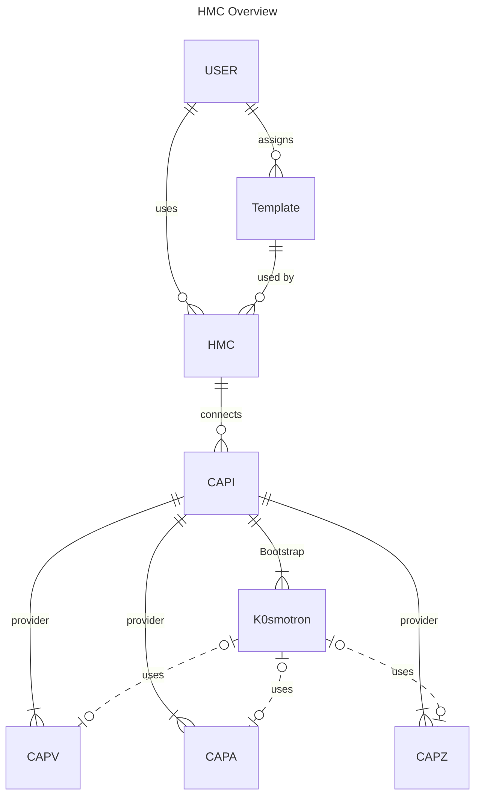

# Project Overview

```mermaid
---
title: HMC Overview
---
erDiagram
    USER ||--o{ HMC : uses
    USER ||--o{ Template : assigns
    Template ||--o{ HMC : "used by"
    HMC ||--o{ CAPI : connects
    CAPI ||--|{ CAPV : provider
    CAPI ||--|{ CAPA : provider
    CAPI ||--|{ CAPZ : provider
    CAPI ||--|{ K0smotron : Bootstrap
    K0smotron |o..o| CAPV : uses
    K0smotron |o..o| CAPA : uses
    K0smotron |o..o| CAPZ : uses
```